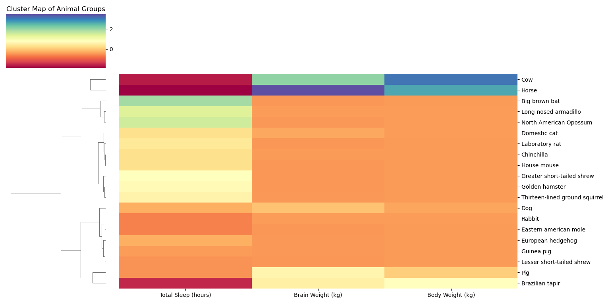

# ClusteredCritters

This project focuses on clustering animal species based on their sleep patterns and physical attributes using hierarchical clustering and visualization with a cluster map. The dataset, `msleep.csv`, contains various characteristics of animals, including sleep duration, brain and body weight, and dietary categories.

## Table of Contents
- [Dataset](#dataset)
- [Project Workflow](#project-workflow)
  - [Data Preprocessing](#data-preprocessing)
  - [Feature Selection](#feature-selection)
  - [Data Normalization](#data-normalization)
  - [Hierarchical Clustering](#hierarchical-clustering)
  - [Visualization](#visualization)
    - [Cluster Map](#cluster-map)

## Dataset
The dataset (`msleep.csv`) includes the following columns:

- **name**: Common name of the animal.
- **genus**: Genus to which the animal belongs.
- **vore**: Type of diet, e.g., carnivore, herbivore, omnivore.
- **order**: Scientific order of the animal.
- **conservation**: Conservation status (e.g., `lc` for least concern, `nt` for near threatened).
- **sleep_total**: Total sleep time per day (in hours).
- **sleep_rem**: REM sleep time per day (in hours).
- **sleep_cycle**: Duration of each sleep cycle (in hours).
- **awake**: Total awake time per day (in hours).
- **brainwt**: Brain weight (in kilograms).
- **bodywt**: Body weight (in kilograms).

## Project Workflow
### Data Preprocessing
- Missing values are dropped to ensure consistency in clustering.

### Feature Selection
- Key attributes for clustering are chosen: `sleep_total`, `brainwt`, and `bodywt`.

### Data Normalization
- `StandardScaler` is used to normalize data, ensuring each feature has a mean of 0 and standard deviation of 1.

### Hierarchical Clustering
- A linkage matrix is created using the Ward method for hierarchical clustering.

### Visualization
- A clustered heatmap (`clustermap`) is generated to show clusters of animals with similar sleep and weight patterns.
  
The cluster map provides insights into animal groups based on their sleep duration, brain weight, and body weight. Species with similar patterns are clustered together, which may offer insights into their behavioral and physiological traits.
### Cluster Map

